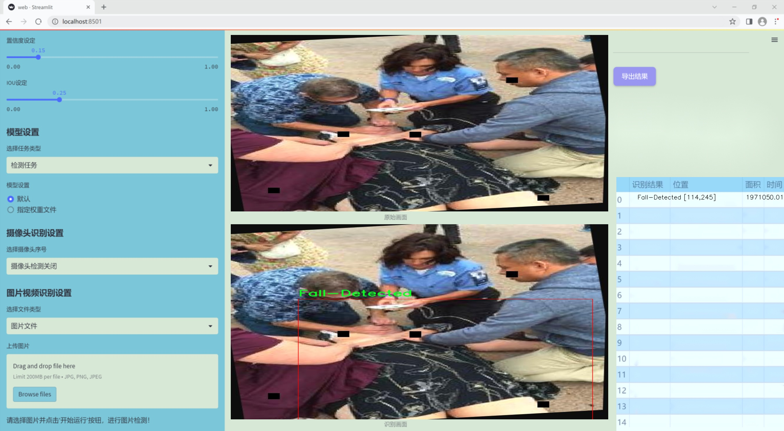
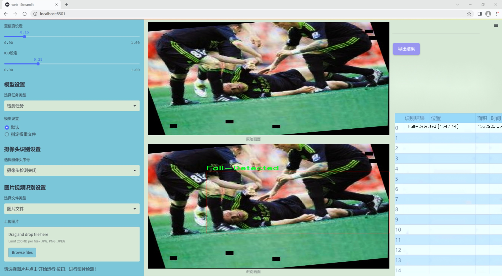
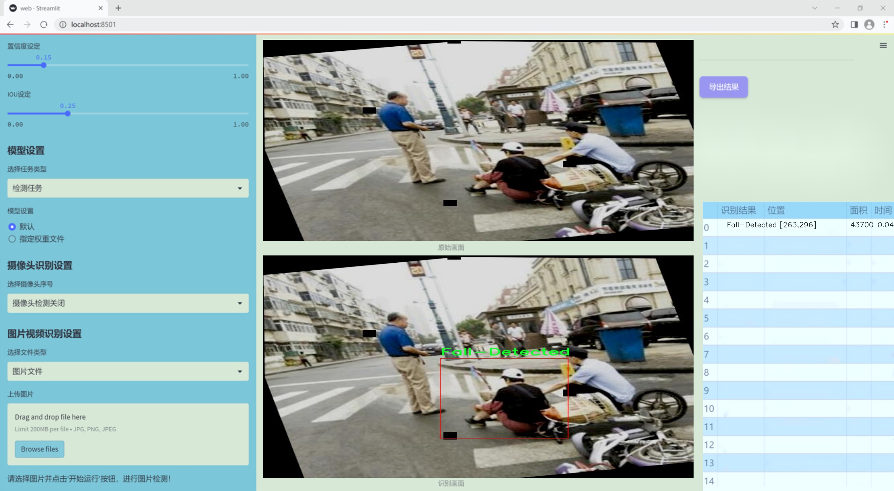
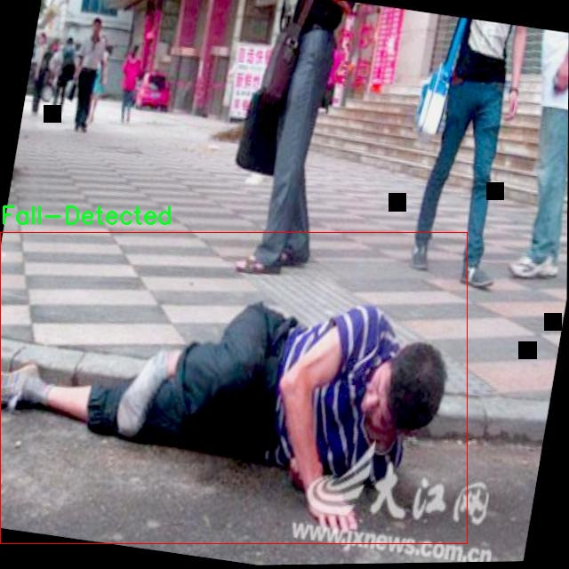
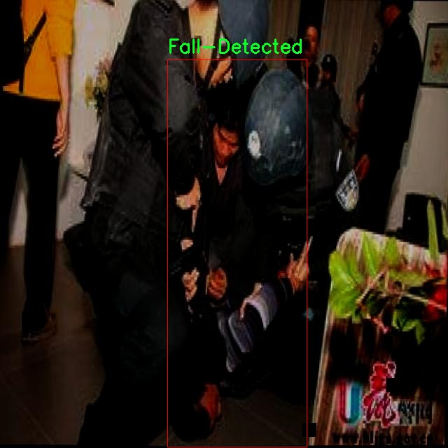
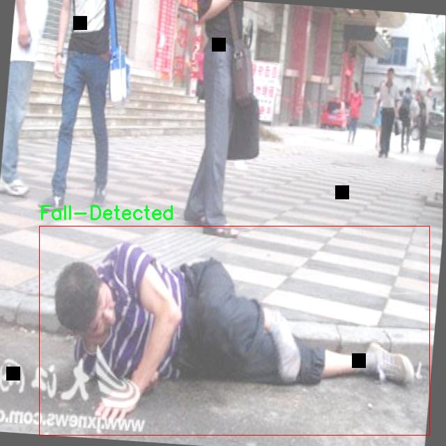
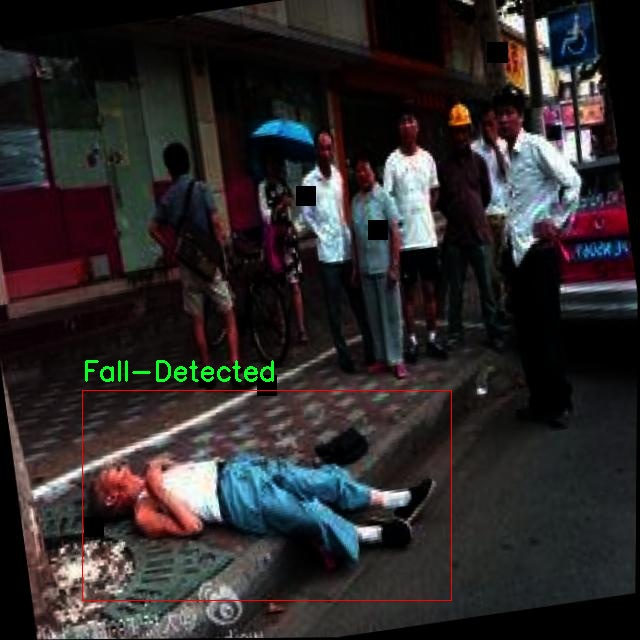
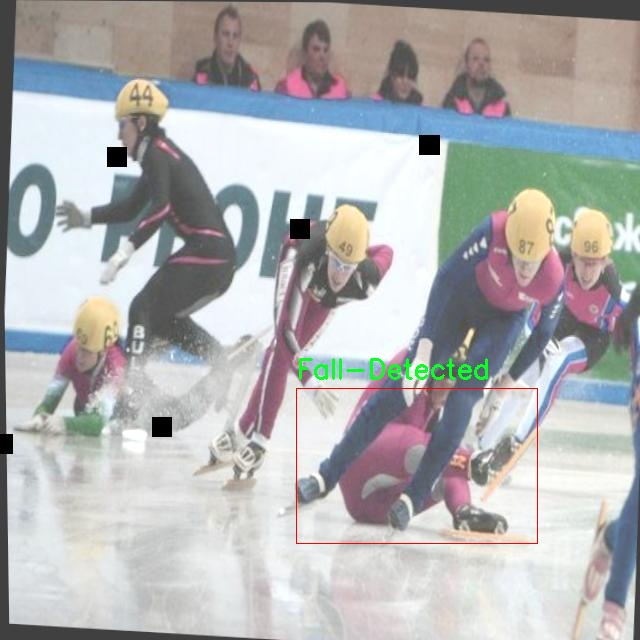

# 改进yolo11-AFPN-P345等200+全套创新点大全：跌倒检测系统源码＆数据集全套

### 1.图片效果展示







##### 项目来源 **[人工智能促进会 2024.10.28](https://kdocs.cn/l/cszuIiCKVNis)**

注意：由于项目一直在更新迭代，上面“1.图片效果展示”和“2.视频效果展示”展示的系统图片或者视频可能为老版本，新版本在老版本的基础上升级如下：（实际效果以升级的新版本为准）

  （1）适配了YOLOV11的“目标检测”模型和“实例分割”模型，通过加载相应的权重（.pt）文件即可自适应加载模型。

  （2）支持“图片识别”、“视频识别”、“摄像头实时识别”三种识别模式。

  （3）支持“图片识别”、“视频识别”、“摄像头实时识别”三种识别结果保存导出，解决手动导出（容易卡顿出现爆内存）存在的问题，识别完自动保存结果并导出到tempDir中。

  （4）支持Web前端系统中的标题、背景图等自定义修改。

  另外本项目提供训练的数据集和训练教程,暂不提供权重文件（best.pt）,需要您按照教程进行训练后实现图片演示和Web前端界面演示的效果。

### 2.视频效果展示

[2.1 视频效果展示](https://www.bilibili.com/video/BV1bz1jYnEvi/)

### 3.背景

研究背景与意义

随着全球老龄化进程的加速，跌倒已成为老年人群体中最常见的意外事故之一，严重影响了老年人的生活质量和健康安全。根据相关统计数据，跌倒事故不仅导致了大量的身体伤害，还增加了医疗负担，给家庭和社会带来了沉重的经济压力。因此，开发高效、准确的跌倒检测系统具有重要的现实意义和社会价值。近年来，深度学习技术的迅猛发展为物体检测和事件识别提供了新的解决方案，其中YOLO（You Only Look Once）系列模型因其高效性和实时性受到广泛关注。

本研究旨在基于改进的YOLOv11模型，构建一个高效的跌倒检测系统。YOLOv11作为最新一代的目标检测模型，具备更强的特征提取能力和更快的处理速度，能够在复杂环境中实现准确的跌倒检测。为实现这一目标，我们将利用包含4500张图像的跌倒检测数据集，该数据集涵盖了三类不同的跌倒场景，确保模型能够在多样化的情况下进行有效学习和推理。通过对数据集的深入分析和处理，我们将针对跌倒事件的特征进行优化，以提高模型的检测精度和鲁棒性。

本研究不仅为老年人跌倒检测提供了一种新的技术手段，也为相关领域的研究提供了理论基础和实践参考。通过构建高效的跌倒检测系统，我们希望能够在一定程度上降低跌倒事故的发生率，提升老年人的生活安全感，进而推动智能家居和健康监护技术的发展。最终，本研究的成果将为社会各界在老年人护理和健康管理方面提供有力支持，促进老年人群体的健康福祉。

### 4.数据集信息展示

##### 4.1 本项目数据集详细数据（类别数＆类别名）

nc: 1
names: ['Fall-Detected']


该项目为【目标检测】数据集，请在【训练教程和Web端加载模型教程（第三步）】这一步的时候按照【目标检测】部分的教程来训练

##### 4.2 本项目数据集信息介绍

本项目数据集信息介绍

本项目所使用的数据集名为“Fall Detection”，专门用于训练和改进YOLOv11的跌倒检测系统。该数据集旨在提供高质量的样本，以支持机器学习模型在跌倒检测任务中的准确性和鲁棒性。数据集中包含的类别数量为1，具体类别为“Fall-Detected”，即跌倒检测。此单一类别的设置使得模型能够专注于识别跌倒事件，从而提高检测的精度和效率。

在数据集的构建过程中，研究团队收集了多种场景下的跌倒视频和图像，确保数据的多样性和代表性。这些数据来源于不同的环境，包括家庭、公共场所和医疗机构等，涵盖了各种可能导致跌倒的情境。通过对这些跌倒事件的详细标注，数据集为YOLOv11模型提供了丰富的训练素材，使其能够在真实世界中有效识别跌倒行为。

此外，为了增强模型的泛化能力，数据集中还包括了不同光照条件、视角和人物特征的样本。这种多样化的训练数据不仅有助于提升模型在实际应用中的表现，还能降低误报率和漏报率，确保在关键时刻能够及时发出警报。通过对“Fall Detection”数据集的深入分析和训练，研究团队期望能够显著提升跌倒检测系统的性能，为老年人和高风险人群提供更为安全的生活环境。总之，该数据集在推动跌倒检测技术进步方面发挥着至关重要的作用。











### 5.全套项目环境部署视频教程（零基础手把手教学）

[5.1 所需软件PyCharm和Anaconda安装教程（第一步）](https://www.bilibili.com/video/BV1BoC1YCEKi/?spm_id_from=333.999.0.0&vd_source=bc9aec86d164b67a7004b996143742dc)


[5.2 安装Python虚拟环境创建和依赖库安装视频教程（第二步）](https://www.bilibili.com/video/BV1ZoC1YCEBw?spm_id_from=333.788.videopod.sections&vd_source=bc9aec86d164b67a7004b996143742dc)

### 6.改进YOLOv11训练教程和Web_UI前端加载模型教程（零基础手把手教学）

[6.1 改进YOLOv11训练教程和Web_UI前端加载模型教程（第三步）](https://www.bilibili.com/video/BV1BoC1YCEhR?spm_id_from=333.788.videopod.sections&vd_source=bc9aec86d164b67a7004b996143742dc)


按照上面的训练视频教程链接加载项目提供的数据集，运行train.py即可开始训练



     Epoch   gpu_mem       box       obj       cls    labels  img_size
     1/200     20.8G   0.01576   0.01955  0.007536        22      1280: 100%|██████████| 849/849 [14:42<00:00,  1.04s/it]
               Class     Images     Labels          P          R     mAP@.5 mAP@.5:.95: 100%|██████████| 213/213 [01:14<00:00,  2.87it/s]
                 all       3395      17314      0.994      0.957      0.0957      0.0843

     Epoch   gpu_mem       box       obj       cls    labels  img_size
     2/200     20.8G   0.01578   0.01923  0.007006        22      1280: 100%|██████████| 849/849 [14:44<00:00,  1.04s/it]
               Class     Images     Labels          P          R     mAP@.5 mAP@.5:.95: 100%|██████████| 213/213 [01:12<00:00,  2.95it/s]
                 all       3395      17314      0.996      0.956      0.0957      0.0845

     Epoch   gpu_mem       box       obj       cls    labels  img_size
     3/200     20.8G   0.01561    0.0191  0.006895        27      1280: 100%|██████████| 849/849 [10:56<00:00,  1.29it/s]
               Class     Images     Labels          P          R     mAP@.5 mAP@.5:.95: 100%|███████   | 187/213 [00:52<00:00,  4.04it/s]
                 all       3395      17314      0.996      0.957      0.0957      0.0845


###### [项目数据集下载链接](https://kdocs.cn/l/cszuIiCKVNis)

### 7.原始YOLOv11算法讲解


##### YOLOv11三大损失函数

YOLOv11（You Only Look Once）是一种流行的目标检测算法，其损失函数设计用于同时优化分类和定位任务。YOLO的损失函数通常包括几个部分：
**分类损失、定位损失（边界框回归损失）和置信度损失** 。其中，

  1. box_loss（边界框回归损失）是用于优化预测边界框与真实边界框之间的差异的部分。

  2. cls_loss（分类损失）是用于优化模型对目标类别的预测准确性的部分。分类损失确保模型能够正确地识别出图像中的对象属于哪个类别。

  3. dfl_loss（Distribution Focal Loss）是YOLO系列中的一种损失函数，特别是在一些改进版本如YOLOv5和YOLOv7中被引入。它的主要目的是解决目标检测中的类别不平衡问题，并提高模型在处理小目标和困难样本时的性能。

##### 边界框回归损失详解

box_loss（边界框回归损失）是用于优化预测边界框与真实边界框之间的差异的部分。


##### box_loss 的具体意义


##### 为什么需要 box_loss

  * 精确定位：通过最小化中心点坐标损失和宽高损失，模型能够更准确地预测目标的位置和大小。
  * 平衡不同类型的目标：使用平方根来处理宽高损失，可以更好地平衡不同大小的目标，确保小目标也能得到足够的关注。
  * 稳定训练：适当的损失函数设计有助于模型的稳定训练，避免梯度爆炸或消失等问题。

##### 分类损失详解

在YOLO（You Only Look
Once）目标检测算法中，cls_loss（分类损失）是用于优化模型对目标类别的预测准确性的部分。分类损失确保模型能够正确地识别出图像中的对象属于哪个类别。下面是关于cls_loss的详细解读：

##### 分类损失 (cls_loss) 的具体意义

  
分类损失通常使用交叉熵损失（Cross-Entropy
Loss）来计算。交叉熵损失衡量的是模型预测的概率分布与真实标签之间的差异。在YOLO中，分类损失的具体形式如下：


##### 为什么需要 cls_loss

  * 类别识别：cls_loss 确保模型能够正确识别出图像中的目标属于哪个类别。这对于目标检测任务至关重要，因为不仅需要知道目标的位置，还需要知道目标的类型。

  * 多类别支持：通过最小化分类损失，模型可以处理多个类别的目标检测任务。例如，在道路缺陷检测中，可能需要识别裂缝、坑洞、路面破损等多种类型的缺陷。

  * 提高准确性：分类损失有助于提高模型的分类准确性，从而提升整体检测性能。通过优化分类损失，模型可以更好地学习不同类别之间的特征差异。

##### 分布损失详解

`dfl_loss`（Distribution Focal
Loss）是YOLO系列中的一种损失函数，特别是在一些改进版本如YOLOv5和YOLOv7中被引入。它的主要目的是解决目标检测中的类别不平衡问题，并提高模型在处理小目标和困难样本时的性能。下面是对`dfl_loss`的详细解读：

##### DFL Loss 的背景

在目标检测任务中，类别不平衡是一个常见的问题。某些类别的样本数量可能远远多于其他类别，这会导致模型在训练过程中对常见类别的学习效果较好，而对罕见类别的学习效果较差。此外，小目标和困难样本的检测也是一个挑战，因为这些目标通常具有较少的特征信息，容易被忽略或误分类。

为了应对这些问题，研究者们提出了多种改进方法，其中之一就是`dfl_loss`。`dfl_loss`通过引入分布焦点损失来增强模型对困难样本的关注，并改善类别不平衡问题。

##### DFL Loss 的定义

DFL Loss
通常与传统的交叉熵损失结合使用，以增强模型对困难样本的学习能力。其核心思想是通过对每个类别的预测概率进行加权，使得模型更加关注那些难以正确分类的样本。

DFL Loss 的公式可以表示为：


##### DFL Loss 的具体意义**

  * **类别不平衡：** 通过引入平衡因子 α，DFL Loss 可以更好地处理类别不平衡问题。对于少数类别的样本，可以通过增加其权重来提升其重要性，从而提高模型对这些类别的检测性能。
  *  **困难样本：** 通过聚焦参数 γ，DFL Loss 可以让模型更加关注那些难以正确分类的样本。当 
  * γ 较大时，模型会对那些预测概率较低的样本给予更多的关注，从而提高这些样本的分类准确性。
  *  **提高整体性能** ：DFL Loss 结合了传统交叉熵损失的优势，并通过加权机制增强了模型对困难样本的学习能力，从而提高了整体的检测性能。


### 8.200+种全套改进YOLOV11创新点原理讲解

#### 8.1 200+种全套改进YOLOV11创新点原理讲解大全

由于篇幅限制，每个创新点的具体原理讲解就不全部展开，具体见下列网址中的改进模块对应项目的技术原理博客网址【Blog】（创新点均为模块化搭建，原理适配YOLOv5~YOLOv11等各种版本）

[改进模块技术原理博客【Blog】网址链接](https://gitee.com/qunmasj/good)


#### 8.2 精选部分改进YOLOV11创新点原理讲解

###### 这里节选部分改进创新点展开原理讲解(完整的改进原理见上图和[改进模块技术原理博客链接](https://gitee.com/qunmasj/good)【如果此小节的图加载失败可以通过CSDN或者Github搜索该博客的标题访问原始博客，原始博客图片显示正常】


借鉴了其他算法的这些设计思想

借鉴了VGG的思想，使用了较多的3×3卷积，在每一次池化操作后，将通道数翻倍；

借鉴了network in network的思想，使用全局平均池化（global average pooling）做预测，并把1×1的卷积核置于3×3的卷积核之间，用来压缩特征；（我没找到这一步体现在哪里）

使用了批归一化层稳定模型训练，加速收敛，并且起到正则化作用。

    以上三点为Darknet19借鉴其他模型的点。Darknet53当然是在继承了Darknet19的这些优点的基础上再新增了下面这些优点的。因此列在了这里

借鉴了ResNet的思想，在网络中大量使用了残差连接，因此网络结构可以设计的很深，并且缓解了训练中梯度消失的问题，使得模型更容易收敛。

使用步长为2的卷积层代替池化层实现降采样。（这一点在经典的Darknet-53上是很明显的，output的长和宽从256降到128，再降低到64，一路降低到8，应该是通过步长为2的卷积层实现的；在YOLOv11的卷积层中也有体现，比如图中我标出的这些位置）

#### 特征融合

模型架构图如下

  Darknet-53的特点可以这样概括：（Conv卷积模块+Residual Block残差块）串行叠加4次

  Conv卷积层+Residual Block残差网络就被称为一个stage


上面红色指出的那个，原始的Darknet-53里面有一层 卷积，在YOLOv11里面，把一层卷积移除了

为什么移除呢？

        原始Darknet-53模型中间加的这个卷积层做了什么？滤波器（卷积核）的个数从 上一个卷积层的512个，先增加到1024个卷积核，然后下一层卷积的卷积核的个数又降低到512个

        移除掉这一层以后，少了1024个卷积核，就可以少做1024次卷积运算，同时也少了1024个3×3的卷积核的参数，也就是少了9×1024个参数需要拟合。这样可以大大减少了模型的参数，（相当于做了轻量化吧）

        移除掉这个卷积层，可能是因为作者发现移除掉这个卷积层以后，模型的score有所提升，所以才移除掉的。为什么移除掉以后，分数有所提高呢？可能是因为多了这些参数就容易，参数过多导致模型在训练集删过拟合，但是在测试集上表现很差，最终模型的分数比较低。你移除掉这个卷积层以后，参数减少了，过拟合现象不那么严重了，泛化能力增强了。当然这个是，拿着你做实验的结论，反过来再找补，再去强行解释这种现象的合理性。

过拟合


通过MMdetection官方绘制册这个图我们可以看到，进来的这张图片经过一个“Feature Pyramid Network(简称FPN)”，然后最后的P3、P4、P5传递给下一层的Neck和Head去做识别任务。 PAN（Path Aggregation Network）


“FPN是自顶向下，将高层的强语义特征传递下来。PAN就是在FPN的后面添加一个自底向上的金字塔，对FPN补充，将低层的强定位特征传递上去，

FPN是自顶（小尺寸，卷积次数多得到的结果，语义信息丰富）向下（大尺寸，卷积次数少得到的结果），将高层的强语义特征传递下来，对整个金字塔进行增强，不过只增强了语义信息，对定位信息没有传递。PAN就是针对这一点，在FPN的后面添加一个自底（卷积次数少，大尺寸）向上（卷积次数多，小尺寸，语义信息丰富）的金字塔，对FPN补充，将低层的强定位特征传递上去，又被称之为“双塔战术”。

FPN层自顶向下传达强语义特征，而特征金字塔则自底向上传达强定位特征，两两联手，从不同的主干层对不同的检测层进行参数聚合,这样的操作确实很皮。
#### 自底向上增强

而 PAN（Path Aggregation Network）是对 FPN 的一种改进，它的设计理念是在 FPN 后面添加一个自底向上的金字塔。PAN 引入了路径聚合的方式，通过将浅层特征图（低分辨率但语义信息较弱）和深层特征图（高分辨率但语义信息丰富）进行聚合，并沿着特定的路径传递特征信息，将低层的强定位特征传递上去。这样的操作能够进一步增强多尺度特征的表达能力，使得 PAN 在目标检测任务中表现更加优秀。


### 可重参化EfficientRepBiPAN优化Neck
#### Repvgg-style
Repvgg-style的卷积层包含
卷积+ReLU结构，该结构能够有效地利用硬件资源。

在训练时，Repvgg-style的卷积层包含
卷积、
卷积、identity。（下图左图）


在推理时，通过重参数化（re-parameterization），上述的多分支结构可以转换为单分支的
卷积。（下图右图）


基于上述思想，作者设计了对GPU硬件友好的EfficientRep Backbone和Rep-PAN Neck，将它们用于YOLOv6中。

EfficientRep Backbone的结构图：


Rep-PAN Neck结构图：


#### Multi-path
只使用repvgg-style不能达到很好的精度-速度平衡，对于大模型，作者探索了多路径的网络结构。

参考该博客提出了Bep unit，其结构如下图所示：


CSP（Cross Stage Partial）-style计算量小，且有丰富的梯度融合信息，广泛应用于YOLO系列中，比如YOLOv11、PPYOLOE。

作者将Bep unit与CSP-style结合，设计了一种新的网络结构BepC3，如下图所示：


基于BepC3模块，作者设计了新的CSPBep Backbone和CSPRepPAN Neck，以达到很好的精度-速度平衡。

其他YOLO系列在使用CSP-stype结构时，partial ratio设置为1/2。为了达到更好的性能，在YOLOv6m中partial ratio的值为2/3，在YOLOv6l中partial ratio的值为1/2。

对于YOLOv6m，单纯使用Rep-style结构和使用BepC3结构的对比如下图所示：

#### BIFPN
BiFPN 全称 Bidirectional Feature Pyramid Network 加权双向（自顶向下 + 自低向上）特征金字塔网络。

相比较于PANet，BiFPN在设计上的改变：

总结下图：
图d 蓝色部分为自顶向下的通路，传递的是高层特征的语义信息；红色部分是自底向上的通路，传递的是低层特征的位置信息；紫色部分是上述第二点提到的同一层在输入节点和输入节点间新加的一条边。


我们删除那些只有一条输入边的节点。这么做的思路很简单：如果一个节点只有一条输入边而没有特征融合，那么它对旨在融合不同特征的特征网络的贡献就会很小。删除它对我们的网络影响不大，同时简化了双向网络；如上图d 的 P7右边第一个节点

如果原始输入节点和输出节点处于同一层，我们会在原始输入节点和输出节点之间添加一条额外的边。思路：以在不增加太多成本的情况下融合更多的特性；

与只有一个自顶向下和一个自底向上路径的PANet不同，我们处理每个双向路径(自顶向下和自底而上)路径作为一个特征网络层，并重复同一层多次，以实现更高层次的特征融合。如下图EfficientNet 的网络结构所示，我们对BiFPN是重复使用多次的。而这个使用次数也不是我们认为设定的，而是作为参数一起加入网络的设计当中，使用NAS技术算出来的。


Weighted Feature Fusion 带权特征融合：学习不同输入特征的重要性，对不同输入特征有区分的融合。
设计思路：传统的特征融合往往只是简单的 feature map 叠加/相加 (sum them up)，比如使用concat或者shortcut连接，而不对同时加进来的 feature map 进行区分。然而，不同的输入 feature map 具有不同的分辨率，它们对融合输入 feature map 的贡献也是不同的，因此简单的对他们进行相加或叠加处理并不是最佳的操作。所以这里我们提出了一种简单而高效的加权特融合的机制。
常见的带权特征融合有三种方法，分别是：


​
  这种方法比较简单，直接加一个可学习的权重。但是由于这个权重不受限制，所有可能引起训练的不稳定，所有并不推荐。
Softmax-based fusion: O = ∑ i e w i ∗ I i ϵ + ∑ j e w j O = \sum_{i} \frac{e^{w_i} * I_i}{ \epsilon+\sum_{j}e^{w_j}}O=∑ 

 

​
  使用这种方法可以将范围放缩到 [ 0 , 1 ] [0, 1][0,1] 之间，训练稳定，但是训练很慢，所有也不推荐。
Fast normalized fusion: O = ∑ i w i ∗ I i ϵ + ∑ j w j O = \sum_{i} \frac{w_i * I_i}{ \epsilon+\sum_{j}w_j}O=∑ 


### 9.系统功能展示

图9.1.系统支持检测结果表格显示

  图9.2.系统支持置信度和IOU阈值手动调节

  图9.3.系统支持自定义加载权重文件best.pt(需要你通过步骤5中训练获得)

  图9.4.系统支持摄像头实时识别

  图9.5.系统支持图片识别

  图9.6.系统支持视频识别

  图9.7.系统支持识别结果文件自动保存

  图9.8.系统支持Excel导出检测结果数据


### 10. YOLOv11核心改进源码讲解

#### 10.1 ui.py

以下是对代码的核心部分进行提炼和详细注释的版本：

```python
import sys  # 导入sys模块，用于访问与Python解释器相关的变量和函数
import subprocess  # 导入subprocess模块，用于执行外部命令

def run_script(script_path):
    """
    使用当前 Python 环境运行指定的脚本。

    Args:
        script_path (str): 要运行的脚本路径

    Returns:
        None
    """
    # 获取当前 Python 解释器的路径
    python_path = sys.executable

    # 构建运行命令，使用streamlit运行指定的脚本
    command = f'"{python_path}" -m streamlit run "{script_path}"'

    # 执行命令，并等待其完成
    result = subprocess.run(command, shell=True)
    
    # 检查命令执行结果，如果返回码不为0，则表示出错
    if result.returncode != 0:
        print("脚本运行出错。")

# 程序入口
if __name__ == "__main__":
    # 指定要运行的脚本路径
    script_path = "web.py"  # 假设脚本文件名为web.py

    # 调用函数运行脚本
    run_script(script_path)
```

### 代码核心部分说明：
1. **导入模块**：
   - `sys`模块用于获取当前Python解释器的路径。
   - `subprocess`模块用于执行外部命令，允许我们在Python中运行其他程序。

2. **`run_script`函数**：
   - 接受一个参数`script_path`，表示要运行的Python脚本的路径。
   - 使用`sys.executable`获取当前Python解释器的路径，以确保使用相同的环境来运行脚本。
   - 构建命令字符串，使用`streamlit`模块运行指定的脚本。
   - 使用`subprocess.run`执行命令，并检查返回码以判断脚本是否成功运行。

3. **程序入口**：
   - 使用`if __name__ == "__main__":`确保只有在直接运行该脚本时才会执行以下代码。
   - 指定要运行的脚本路径（在这里假设为`web.py`）。
   - 调用`run_script`函数来执行指定的脚本。 

通过这种方式，代码实现了在当前Python环境中运行指定的Streamlit脚本，并能处理运行过程中的错误。

这个程序文件 `ui.py` 的主要功能是通过当前的 Python 环境来运行一个指定的脚本，具体来说是运行一个名为 `web.py` 的脚本。文件的开头导入了一些必要的模块，包括 `sys`、`os` 和 `subprocess`，这些模块分别用于获取系统信息、处理文件路径和执行外部命令。

在文件中定义了一个名为 `run_script` 的函数，该函数接受一个参数 `script_path`，表示要运行的脚本的路径。函数内部首先获取当前 Python 解释器的路径，然后构建一个命令字符串，这个命令字符串使用了 `streamlit` 模块来运行指定的脚本。具体的命令格式是 `python -m streamlit run "script_path"`，其中 `script_path` 是传入的脚本路径。

接下来，使用 `subprocess.run` 方法来执行这个命令。该方法的 `shell=True` 参数表示在一个新的 shell 中执行命令。执行后，函数会检查命令的返回码，如果返回码不为 0，说明脚本运行出错，此时会打印出错误信息。

在文件的最后部分，使用 `if __name__ == "__main__":` 语句来确保只有在直接运行该文件时才会执行以下代码。这里指定了要运行的脚本路径为 `web.py`，并调用 `run_script` 函数来执行这个脚本。

总的来说，这个文件的作用是提供一个简单的接口，通过 Python 环境来运行一个 Streamlit 应用脚本，方便用户进行开发和调试。

#### 10.2 hcfnet.py

以下是代码中最核心的部分，并附上详细的中文注释：

```python
import torch
import torch.nn as nn
import torch.nn.functional as F

class SpatialAttentionModule(nn.Module):
    def __init__(self):
        super(SpatialAttentionModule, self).__init__()
        # 定义一个2D卷积层，用于生成空间注意力图
        self.conv2d = nn.Conv2d(in_channels=2, out_channels=1, kernel_size=7, stride=1, padding=3)
        self.sigmoid = nn.Sigmoid()  # 使用Sigmoid激活函数将输出限制在0到1之间

    def forward(self, x):
        # 计算输入特征图的平均值和最大值
        avgout = torch.mean(x, dim=1, keepdim=True)  # 在通道维度上计算平均值
        maxout, _ = torch.max(x, dim=1, keepdim=True)  # 在通道维度上计算最大值
        out = torch.cat([avgout, maxout], dim=1)  # 将平均值和最大值拼接在一起
        out = self.sigmoid(self.conv2d(out))  # 通过卷积层和Sigmoid激活函数生成注意力图
        return out * x  # 将注意力图与输入特征图相乘，进行加权

class LocalGlobalAttention(nn.Module):
    def __init__(self, output_dim, patch_size):
        super().__init__()
        self.output_dim = output_dim
        self.patch_size = patch_size
        # 定义多层感知机（MLP）和归一化层
        self.mlp1 = nn.Linear(patch_size * patch_size, output_dim // 2)
        self.norm = nn.LayerNorm(output_dim // 2)
        self.mlp2 = nn.Linear(output_dim // 2, output_dim)
        self.conv = nn.Conv2d(output_dim, output_dim, kernel_size=1)  # 1x1卷积
        self.prompt = torch.nn.parameter.Parameter(torch.randn(output_dim, requires_grad=True))  # 可学习的参数
        self.top_down_transform = torch.nn.parameter.Parameter(torch.eye(output_dim), requires_grad=True)  # 可学习的参数

    def forward(self, x):
        x = x.permute(0, 2, 3, 1)  # 调整维度顺序
        B, H, W, C = x.shape  # 获取批量大小、高度、宽度和通道数
        P = self.patch_size

        # 处理局部特征
        local_patches = x.unfold(1, P, P).unfold(2, P, P)  # 提取局部补丁
        local_patches = local_patches.reshape(B, -1, P * P, C)  # 重塑形状
        local_patches = local_patches.mean(dim=-1)  # 在通道维度上计算平均值

        local_patches = self.mlp1(local_patches)  # 通过第一个MLP
        local_patches = self.norm(local_patches)  # 归一化
        local_patches = self.mlp2(local_patches)  # 通过第二个MLP

        local_attention = F.softmax(local_patches, dim=-1)  # 计算局部注意力
        local_out = local_patches * local_attention  # 加权局部特征

        # 计算与提示向量的余弦相似度
        cos_sim = F.normalize(local_out, dim=-1) @ F.normalize(self.prompt[None, ..., None], dim=1)  # 计算余弦相似度
        mask = cos_sim.clamp(0, 1)  # 限制在0到1之间
        local_out = local_out * mask  # 应用掩码
        local_out = local_out @ self.top_down_transform  # 应用变换

        # 恢复形状
        local_out = local_out.reshape(B, H // P, W // P, self.output_dim)  # 重塑形状
        local_out = local_out.permute(0, 3, 1, 2)  # 调整维度顺序
        local_out = F.interpolate(local_out, size=(H, W), mode='bilinear', align_corners=False)  # 上采样
        output = self.conv(local_out)  # 通过1x1卷积生成输出

        return output

class PPA(nn.Module):
    def __init__(self, in_features, filters) -> None:
        super().__init__()
        # 定义多个卷积层和注意力模块
        self.skip = nn.Conv2d(in_features, filters, kernel_size=1)  # 跳跃连接
        self.c1 = nn.Conv2d(filters, filters, kernel_size=3, padding=1)
        self.c2 = nn.Conv2d(filters, filters, kernel_size=3, padding=1)
        self.c3 = nn.Conv2d(filters, filters, kernel_size=3, padding=1)
        self.sa = SpatialAttentionModule()  # 空间注意力模块
        self.lga2 = LocalGlobalAttention(filters, 2)  # 局部全局注意力模块
        self.lga4 = LocalGlobalAttention(filters, 4)  # 局部全局注意力模块
        self.bn1 = nn.BatchNorm2d(filters)  # 批归一化
        self.silu = nn.SiLU()  # SiLU激活函数

    def forward(self, x):
        x_skip = self.skip(x)  # 跳跃连接
        x_lga2 = self.lga2(x_skip)  # 通过局部全局注意力模块
        x_lga4 = self.lga4(x_skip)  # 通过局部全局注意力模块
        x1 = self.c1(x)  # 通过卷积层
        x2 = self.c2(x1)  # 通过卷积层
        x3 = self.c3(x2)  # 通过卷积层
        # 将所有特征图相加
        x = x1 + x2 + x3 + x_skip + x_lga2 + x_lga4
        x = self.sa(x)  # 通过空间注意力模块
        x = self.bn1(x)  # 批归一化
        x = self.silu(x)  # SiLU激活
        return x  # 返回输出
```

以上代码实现了一个包含空间注意力和局部全局注意力的深度学习模块，适用于图像处理任务。每个模块都有其特定的功能，通过组合这些模块，可以提取更丰富的特征。

这个程序文件 `hcfnet.py` 实现了一个深度学习模型，主要用于图像处理任务。代码中定义了多个类，每个类实现了特定的功能模块，下面是对这些模块的详细说明。

首先，文件导入了必要的库，包括 `math`、`torch` 及其子模块 `nn` 和 `functional`，这些库为构建神经网络提供了基础。`Conv` 是一个自定义的卷积模块，可能在其他地方定义。

接下来，定义了 `SpatialAttentionModule` 类。这个类实现了空间注意力机制。其构造函数中创建了一个卷积层和一个 Sigmoid 激活函数。在前向传播中，首先计算输入特征图的平均值和最大值，然后将它们拼接在一起，通过卷积层和 Sigmoid 函数生成注意力权重，最后将权重应用于输入特征图，以增强重要区域的特征。

然后是 `LocalGlobalAttention` 类。这个类结合了局部和全局注意力机制。构造函数中定义了多个线性层、卷积层和可学习的参数。在前向传播中，输入特征图被重排列并分割成局部补丁。局部补丁经过处理后，生成局部注意力特征，并与全局特征结合，最终通过卷积层输出结果。

接下来是 `ECA` 类，它实现了有效的通道注意力机制。构造函数中计算了卷积核的大小，并创建了自适应平均池化层和卷积层。在前向传播中，输入特征图通过池化层获得全局特征，然后通过卷积层生成通道注意力权重，最后将权重应用于输入特征图。

`PPA` 类是一个更复杂的模块，结合了多个卷积层、空间注意力模块、通道注意力模块和局部全局注意力模块。构造函数中定义了这些子模块。在前向传播中，输入特征图经过一系列卷积和注意力机制的处理，最终输出增强后的特征图。

`Bag` 类实现了一个简单的加权融合机制，通过对输入特征图进行加权平均，生成融合后的特征图。

最后是 `DASI` 类，它是整个模型的尾部模块，负责将不同尺度的特征进行融合。构造函数中定义了多个卷积层和跳跃连接。在前向传播中，输入特征图被处理和融合，最终输出经过归一化和激活函数处理的特征图。

整体来看，这个文件实现了一个结合了多种注意力机制和特征融合策略的深度学习模型，旨在提高图像处理任务中的特征提取能力。

#### 10.3 afpn.py

以下是保留的核心代码部分，并附上详细的中文注释：

```python
import torch
import torch.nn as nn
import torch.nn.functional as F
from ..modules.conv import Conv

class BasicBlock(nn.Module):
    """基本块，包含两个卷积层和残差连接"""
    def __init__(self, filter_in, filter_out):
        super(BasicBlock, self).__init__()
        # 第一个卷积层，使用3x3卷积
        self.conv1 = Conv(filter_in, filter_out, 3)
        # 第二个卷积层，使用3x3卷积，不使用激活函数
        self.conv2 = Conv(filter_out, filter_out, 3, act=False)

    def forward(self, x):
        residual = x  # 保存输入，用于残差连接
        out = self.conv1(x)  # 通过第一个卷积层
        out = self.conv2(out)  # 通过第二个卷积层
        out += residual  # 添加残差
        return self.conv1.act(out)  # 返回激活后的输出

class Upsample(nn.Module):
    """上采样模块，使用1x1卷积和双线性插值"""
    def __init__(self, in_channels, out_channels, scale_factor=2):
        super(Upsample, self).__init__()
        self.upsample = nn.Sequential(
            Conv(in_channels, out_channels, 1),  # 1x1卷积
            nn.Upsample(scale_factor=scale_factor, mode='bilinear')  # 双线性插值上采样
        )

    def forward(self, x):
        return self.upsample(x)  # 返回上采样后的输出

class Downsample_x2(nn.Module):
    """下采样模块，使用2x2卷积"""
    def __init__(self, in_channels, out_channels):
        super(Downsample_x2, self).__init__()
        self.downsample = Conv(in_channels, out_channels, 2, 2, 0)  # 2x2卷积，步幅为2

    def forward(self, x):
        return self.downsample(x)  # 返回下采样后的输出

class ASFF_2(nn.Module):
    """自适应特征融合模块，融合两个输入特征图"""
    def __init__(self, inter_dim=512):
        super(ASFF_2, self).__init__()
        self.inter_dim = inter_dim
        compress_c = 8  # 压缩通道数

        # 为每个输入特征图创建权重卷积
        self.weight_level_1 = Conv(self.inter_dim, compress_c, 1)
        self.weight_level_2 = Conv(self.inter_dim, compress_c, 1)
        self.weight_levels = nn.Conv2d(compress_c * 2, 2, kernel_size=1, stride=1, padding=0)  # 权重融合
        self.conv = Conv(self.inter_dim, self.inter_dim, 3)  # 最后的卷积层

    def forward(self, input1, input2):
        # 计算每个输入的权重
        level_1_weight_v = self.weight_level_1(input1)
        level_2_weight_v = self.weight_level_2(input2)

        # 合并权重并计算softmax
        levels_weight_v = torch.cat((level_1_weight_v, level_2_weight_v), 1)
        levels_weight = self.weight_levels(levels_weight_v)
        levels_weight = F.softmax(levels_weight, dim=1)  # 归一化权重

        # 融合特征图
        fused_out_reduced = input1 * levels_weight[:, 0:1, :, :] + input2 * levels_weight[:, 1:2, :, :]
        out = self.conv(fused_out_reduced)  # 通过卷积层
        return out  # 返回融合后的输出

class BlockBody_P345(nn.Module):
    """特征块体，处理三个不同尺度的特征图"""
    def __init__(self, channels=[64, 128, 256, 512]):
        super(BlockBody_P345, self).__init__()

        # 定义不同尺度的卷积块
        self.blocks_scalezero1 = nn.Sequential(Conv(channels[0], channels[0], 1))
        self.blocks_scaleone1 = nn.Sequential(Conv(channels[1], channels[1], 1))
        self.blocks_scaletwo1 = nn.Sequential(Conv(channels[2], channels[2], 1))

        # 定义下采样和上采样模块
        self.downsample_scalezero1_2 = Downsample_x2(channels[0], channels[1])
        self.upsample_scaleone1_2 = Upsample(channels[1], channels[0], scale_factor=2)

        # 定义自适应特征融合模块
        self.asff_scalezero1 = ASFF_2(inter_dim=channels[0])
        self.asff_scaleone1 = ASFF_2(inter_dim=channels[1])

        # 定义多个基本块
        self.blocks_scalezero2 = nn.Sequential(
            BasicBlock(channels[0], channels[0]),
            BasicBlock(channels[0], channels[0]),
            BasicBlock(channels[0], channels[0]),
            BasicBlock(channels[0], channels[0]),
        )
        self.blocks_scaleone2 = nn.Sequential(
            BasicBlock(channels[1], channels[1]),
            BasicBlock(channels[1], channels[1]),
            BasicBlock(channels[1], channels[1]),
            BasicBlock(channels[1], channels[1]),
        )

    def forward(self, x):
        x0, x1, x2 = x  # 输入特征图

        # 处理每个尺度的特征图
        x0 = self.blocks_scalezero1(x0)
        x1 = self.blocks_scaleone1(x1)
        x2 = self.blocks_scaletwo1(x2)

        # 进行自适应特征融合
        scalezero = self.asff_scalezero1(x0, self.upsample_scaleone1_2(x1))
        scaleone = self.asff_scaleone1(self.downsample_scalezero1_2(x0), x1)

        # 继续处理融合后的特征图
        x0 = self.blocks_scalezero2(scalezero)
        x1 = self.blocks_scaleone2(scaleone)

        return x0, x1  # 返回处理后的特征图

class AFPN_P345(nn.Module):
    """自适应特征金字塔网络（AFPN）"""
    def __init__(self, in_channels=[256, 512, 1024], out_channels=256, factor=4):
        super(AFPN_P345, self).__init__()

        # 定义输入特征图的卷积层
        self.conv0 = Conv(in_channels[0], in_channels[0] // factor, 1)
        self.conv1 = Conv(in_channels[1], in_channels[1] // factor, 1)
        self.conv2 = Conv(in_channels[2], in_channels[2] // factor, 1)

        # 定义特征块体
        self.body = BlockBody_P345([in_channels[0] // factor, in_channels[1] // factor, in_channels[2] // factor])

        # 定义输出特征图的卷积层
        self.conv00 = Conv(in_channels[0] // factor, out_channels, 1)
        self.conv11 = Conv(in_channels[1] // factor, out_channels, 1)
        self.conv22 = Conv(in_channels[2] // factor, out_channels, 1)

    def forward(self, x):
        x0, x1, x2 = x  # 输入特征图

        # 通过卷积层处理输入特征图
        x0 = self.conv0(x0)
        x1 = self.conv1(x1)
        x2 = self.conv2(x2)

        # 通过特征块体处理特征图
        out0, out1, out2 = self.body([x0, x1, x2])

        # 通过输出卷积层处理特征图
        out0 = self.conv00(out0)
        out1 = self.conv11(out1)
        out2 = self.conv22(out2)

        return [out0, out1, out2]  # 返回输出特征图
```

### 代码说明：
1. **BasicBlock**: 实现了一个基本的卷积块，包含两个卷积层和残差连接。
2. **Upsample 和 Downsample**: 实现了上采样和下采样的功能，分别使用卷积和插值方法。
3. **ASFF_2**: 自适应特征融合模块，能够融合两个输入特征图，并通过学习得到的权重进行加权。
4. **BlockBody_P345**: 处理三个不同尺度的特征图，使用自适应特征融合模块和基本块进行特征提取和融合。
5. **AFPN_P345**: 自适应特征金字塔网络的实现，负责处理输入特征图并输出融合后的特征图。

这个程序文件 `afpn.py` 实现了一个基于深度学习的特征金字塔网络（AFPN，Adaptive Feature Pyramid Network），用于处理图像分割或目标检测等任务。文件中定义了多个类，每个类负责网络的不同部分，下面是对这些类和功能的详细说明。

首先，程序导入了一些必要的库，包括 `torch` 和 `torch.nn`，并从其他模块导入了一些自定义的卷积和块结构。接着，定义了一个名为 `BasicBlock` 的基本模块，它包含两个卷积层，采用残差连接的方式，增强了网络的学习能力。

接下来，定义了一系列上采样和下采样的模块（如 `Upsample`、`Downsample_x2`、`Downsample_x4`、`Downsample_x8`），这些模块用于调整特征图的尺寸，以便在不同的尺度上进行特征融合。

然后，定义了自适应特征融合模块（ASFF），包括 `ASFF_2`、`ASFF_3` 和 `ASFF_4`，这些模块通过计算输入特征图的权重，动态地融合来自不同尺度的特征。ASFF模块的设计使得网络能够更好地利用多尺度信息，从而提高模型的性能。

接下来，定义了 `BlockBody_P345` 和 `BlockBody_P2345` 类，这些类构建了网络的主体结构，包含多个卷积块和特征融合模块。它们通过下采样和上采样操作，逐步处理输入特征图，并在不同尺度之间进行信息的传递和融合。

`BlockBody_P345_Custom` 和 `BlockBody_P2345_Custom` 类是对前者的扩展，允许用户自定义使用的卷积块类型，增强了网络的灵活性。

最后，定义了 `AFPN_P345` 和 `AFPN_P2345` 类，它们是整个网络的高层接口，负责接收输入特征图并通过各个模块进行处理，最终输出融合后的特征图。这些类还包括权重初始化的代码，以确保网络在训练开始时具有良好的性能。

整体来看，这个程序实现了一个灵活且强大的特征金字塔网络结构，能够在多尺度上有效地融合特征，适用于各种计算机视觉任务。

#### 10.4 attention.py

以下是代码中最核心的部分，并附上详细的中文注释：

```python
import torch
from torch import nn

class EMA(nn.Module):
    def __init__(self, channels, factor=8):
        super(EMA, self).__init__()
        self.groups = factor  # 分组数
        assert channels // self.groups > 0  # 确保每组有通道
        self.softmax = nn.Softmax(-1)  # Softmax层
        self.agp = nn.AdaptiveAvgPool2d((1, 1))  # 自适应平均池化
        self.pool_h = nn.AdaptiveAvgPool2d((None, 1))  # 自适应平均池化，按高度
        self.pool_w = nn.AdaptiveAvgPool2d((1, None))  # 自适应平均池化，按宽度
        self.gn = nn.GroupNorm(channels // self.groups, channels // self.groups)  # 分组归一化
        self.conv1x1 = nn.Conv2d(channels // self.groups, channels // self.groups, kernel_size=1)  # 1x1卷积
        self.conv3x3 = nn.Conv2d(channels // self.groups, channels // self.groups, kernel_size=3, padding=1)  # 3x3卷积

    def forward(self, x):
        b, c, h, w = x.size()  # 获取输入的批量大小、通道数、高度和宽度
        group_x = x.reshape(b * self.groups, -1, h, w)  # 将输入重塑为分组形式
        x_h = self.pool_h(group_x)  # 在高度上进行池化
        x_w = self.pool_w(group_x).permute(0, 1, 3, 2)  # 在宽度上进行池化并转置
        hw = self.conv1x1(torch.cat([x_h, x_w], dim=2))  # 连接并通过1x1卷积
        x_h, x_w = torch.split(hw, [h, w], dim=2)  # 分割为高度和宽度的部分
        x1 = self.gn(group_x * x_h.sigmoid() * x_w.permute(0, 1, 3, 2).sigmoid())  # 通过sigmoid激活并归一化
        x2 = self.conv3x3(group_x)  # 通过3x3卷积
        x11 = self.softmax(self.agp(x1).reshape(b * self.groups, -1, 1).permute(0, 2, 1))  # 计算权重
        x12 = x2.reshape(b * self.groups, c // self.groups, -1)  # 重塑x2
        x21 = self.softmax(self.agp(x2).reshape(b * self.groups, -1, 1).permute(0, 2, 1))  # 计算权重
        x22 = x1.reshape(b * self.groups, c // self.groups, -1)  # 重塑x1
        weights = (torch.matmul(x11, x12) + torch.matmul(x21, x22)).reshape(b * self.groups, 1, h, w)  # 计算最终权重
        return (group_x * weights.sigmoid()).reshape(b, c, h, w)  # 返回加权后的输出

class SimAM(nn.Module):
    def __init__(self, e_lambda=1e-4):
        super(SimAM, self).__init__()
        self.activaton = nn.Sigmoid()  # Sigmoid激活函数
        self.e_lambda = e_lambda  # 正则化参数

    def forward(self, x):
        b, c, h, w = x.size()  # 获取输入的批量大小、通道数、高度和宽度
        n = w * h - 1  # 计算总的像素数减去1
        x_minus_mu_square = (x - x.mean(dim=[2, 3], keepdim=True)).pow(2)  # 计算每个像素与均值的平方差
        y = x_minus_mu_square / (4 * (x_minus_mu_square.sum(dim=[2, 3], keepdim=True) / n + self.e_lambda)) + 0.5  # 计算y值
        return x * self.activaton(y)  # 返回加权后的输出

class SpatialGroupEnhance(nn.Module):
    def __init__(self, groups=8):
        super().__init__()
        self.groups = groups  # 分组数
        self.avg_pool = nn.AdaptiveAvgPool2d(1)  # 自适应平均池化
        self.weight = nn.Parameter(torch.zeros(1, groups, 1, 1))  # 权重参数
        self.bias = nn.Parameter(torch.zeros(1, groups, 1, 1))  # 偏置参数
        self.sig = nn.Sigmoid()  # Sigmoid激活函数
        self.init_weights()  # 初始化权重

    def init_weights(self):
        for m in self.modules():
            if isinstance(m, nn.Conv2d):
                nn.init.kaiming_normal_(m.weight, mode='fan_out')  # Kaiming初始化
                if m.bias is not None:
                    nn.init.constant_(m.bias, 0)  # 偏置初始化为0
            elif isinstance(m, nn.BatchNorm2d):
                nn.init.constant_(m.weight, 1)  # 批归一化权重初始化为1
                nn.init.constant_(m.bias, 0)  # 偏置初始化为0
            elif isinstance(m, nn.Linear):
                nn.init.normal_(m.weight, std=0.001)  # 线性层权重初始化
                if m.bias is not None:
                    nn.init.constant_(m.bias, 0)  # 偏置初始化为0

    def forward(self, x):
        b, c, h, w = x.shape  # 获取输入的批量大小、通道数、高度和宽度
        x = x.view(b * self.groups, -1, h, w)  # 重塑为分组形式
        xn = x * self.avg_pool(x)  # 计算加权平均
        xn = xn.sum(dim=1, keepdim=True)  # 在通道维度上求和
        t = xn.view(b * self.groups, -1)  # 重塑
        t = t - t.mean(dim=1, keepdim=True)  # 减去均值
        std = t.std(dim=1, keepdim=True) + 1e-5  # 计算标准差
        t = t / std  # 归一化
        t = t.view(b, self.groups, h, w)  # 重塑
        t = t * self.weight + self.bias  # 加权和偏置
        t = t.view(b * self.groups, 1, h, w)  # 重塑
        x = x * self.sig(t)  # 通过Sigmoid激活函数加权
        x = x.view(b, c, h, w)  # 返回原始形状
        return x
```

以上代码中，`EMA`、`SimAM` 和 `SpatialGroupEnhance` 是核心模块，分别实现了不同的注意力机制和特征增强方法。每个类的构造函数和前向传播方法都有详细的中文注释，解释了各个步骤的目的和实现方式。

这个程序文件 `attention.py` 实现了一系列与注意力机制相关的深度学习模块，主要用于计算机视觉任务中的特征提取和增强。以下是对代码的详细说明：

首先，文件导入了必要的库，包括 PyTorch、torchvision 和其他一些用于实现高效注意力机制的模块。文件中定义了多个类，每个类实现了不同类型的注意力机制或相关操作。

**EMA（Exponential Moving Average）** 类实现了一种通过加权平均来增强特征的机制。它使用了多个卷积层和自适应池化层，通过对输入特征进行处理，生成加权后的输出。

**SimAM（Similarity Attention Module）** 类则通过计算输入特征的均值和方差，生成一个加权系数，并将其应用于输入特征，以增强特征的表达能力。

**SpatialGroupEnhance** 类通过对输入特征进行空间增强，利用平均池化和卷积操作，生成空间注意力图，从而提升特征的表示能力。

**TopkRouting** 类实现了一种可微分的 Top-k 路由机制，用于选择最重要的特征，并根据这些特征计算注意力权重。

**KVGather** 类用于根据路由索引选择键值对（key-value pairs），并根据权重进行加权。

**QKVLinear** 类则用于将输入特征映射到查询（Q）、键（K）和值（V）空间。

**BiLevelRoutingAttention** 类实现了一种双层路由注意力机制，结合了局部和全局的注意力计算，使用了多种卷积和池化操作来增强特征。

**BiLevelRoutingAttention_nchw** 类是 BiLevelRoutingAttention 的一个变体，专门处理 NCHW 格式的输入数据。

**CoordAtt** 类实现了坐标注意力机制，通过对输入特征的空间信息进行建模，生成空间注意力图。

**TripletAttention** 类实现了三重注意力机制，通过对输入特征的不同维度进行注意力计算，增强特征的表达能力。

**BAMBlock** 类结合了通道注意力和空间注意力，通过加权输入特征来提升特征的表示能力。

**EfficientAttention** 类实现了一种高效的注意力机制，结合了多种卷积和注意力计算方法，提升了计算效率。

**LocalWindowAttention** 类实现了局部窗口注意力机制，通过在局部窗口内计算注意力，减少计算复杂度。

**DAttention** 类实现了一种变形卷积注意力机制，通过变形卷积操作增强特征的表达能力。

**各类注意力机制**（如 SEAttention、CPCA、MPCA、AFGCAttention 等）则通过不同的方式增强输入特征的表达能力，利用通道注意力、空间注意力和其他机制，提升模型的性能。

整体来看，这个文件实现了多种先进的注意力机制，旨在通过增强特征的表达能力，提高计算机视觉任务的性能。这些模块可以灵活组合使用，以适应不同的网络架构和任务需求。

注意：由于此博客编辑较早，上面“10.YOLOv11核心改进源码讲解”中部分代码可能会优化升级，仅供参考学习，以“11.完整训练+Web前端界面+200+种全套创新点源码、数据集获取”的内容为准。

### 11.完整训练+Web前端界面+200+种全套创新点源码、数据集获取


# [下载链接：https://mbd.pub/o/bread/Zp6XlZlr](https://mbd.pub/o/bread/Zp6XlZlr)